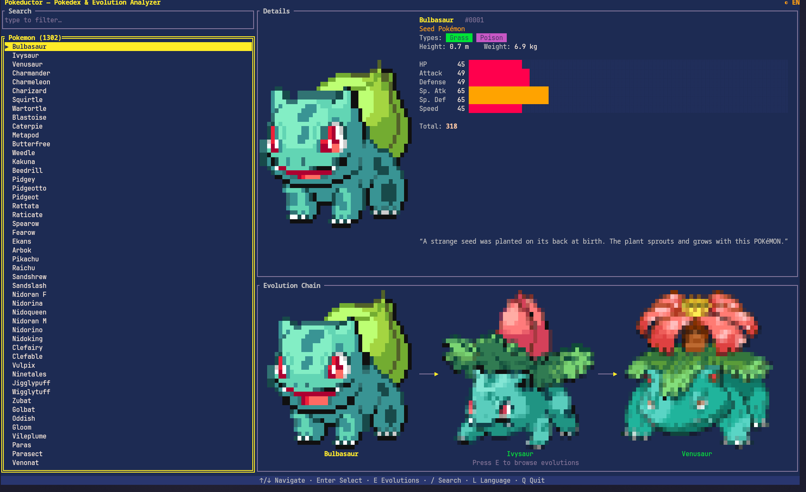
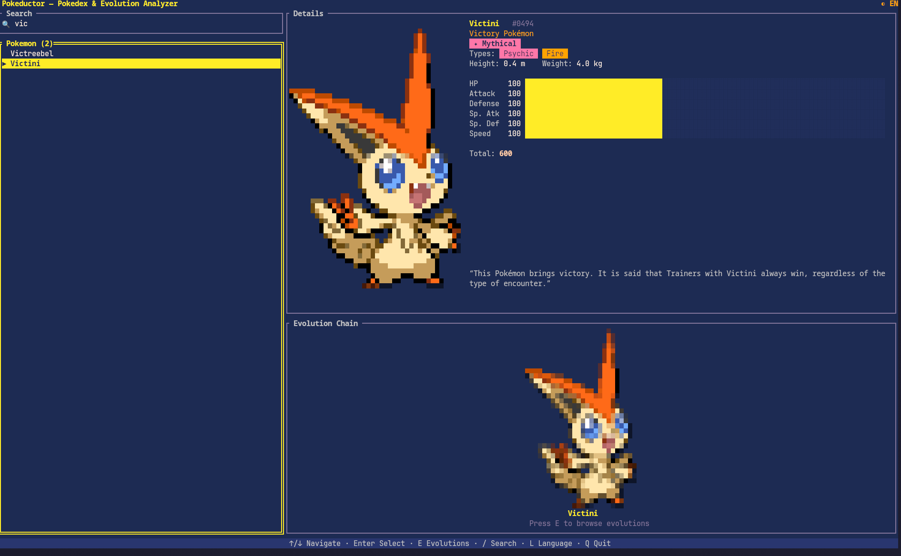
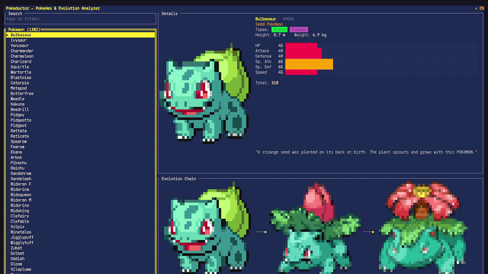

# Pokeductor

**A retro terminal Pokédex & Evolution Analyzer, powered by [PokeAPI](https://pokeapi.co/).**

Browse every species, read localized Pokédex entries, study branching evolution
chains as connected sprite cards — all rendered with Unicode half-blocks in a
warm, PICO-8-inspired palette. Built in Rust with [ratatui](https://ratatui.rs/).


</div>

---

## ✨ Features

- **Full Pokédex** — every species from PokeAPI, searchable and filterable in real time.
- **Sprite rendering in the terminal** — official artwork drawn with Unicode
  upper-half-blocks (two pixels per character cell), cropped to its opaque bounds,
  area-averaged on downscale and alpha-blended over the panel so edges stay clean.
- **Interactive evolution graph** — focus the evolution panel and the chain is laid
  out as connected sprite cards (branching chains like Eevee included). Hop to any
  stage with a keypress to instantly inspect a Pokémon's next evolution.
- **Info cards** — national Pokédex number, genus, flavor-text blurb, and
  **Legendary / Mythical / Baby** badges for each species.
- **6 interface languages** — English, Türkçe, Deutsch, Français, Español, Italiano,
  switchable live from a little picker card.
- **Localized Pokédex text** — flavor/genus come straight from PokeAPI in EN/DE/FR/ES/IT;
  for languages PokeAPI doesn't carry (Turkish), the English entry is machine-translated
  on demand and cached.
- **Responsive layout** — every panel reflows to the terminal size; sprites scale to fit.
- **Snappy & async** — all network I/O runs on `tokio` tasks; the UI never blocks,
  and each species is fetched at most once per session.

---

## 📸 Screenshots


<table>
  <tr>  
    <td align="center">
      <br>
      <sub>Main view — list, details & info card</sub>
    </td>
    <td align="center">
      <br>
      <sub>Search Menu</sub>
    </td>
  </tr>
  <tr>
    <td align="center" colspan="2">
      <br>
      <sub>Quick demo</sub>
    </td>
  </tr>
</table>
---

## 🚀 Getting started

### Requirements

- **Rust** (stable, 2021 edition) — install via [rustup](https://rustup.rs/).
- A **truecolor (24-bit) terminal** for the sprite colors (most modern terminals qualify).
- A font with **Unicode block + box-drawing glyphs** (e.g. any Nerd Font, Fira Code, JetBrains Mono).
- An **internet connection** (data is fetched live from PokeAPI).

### Build & run

```bash
# Clone, then from the project root:
cargo run --release
```

The first launch fetches the species list; selecting a Pokémon loads its details,
evolution chain, and artwork on demand.

---

## ⌨️ Controls

| Context | Key | Action |
|---|---|---|
| **List** | `↑` / `↓` · `j` / `k` | Move selection |
| | `PgUp` / `PgDn` | Jump 10 |
| | `Enter` | Load the highlighted Pokémon |
| | `/` or `Tab` | Focus the search box |
| | `E` | Focus the evolution panel |
| | `L` | Open the language picker |
| | `Q` / `Esc` | Quit |
| **Search** | *type* | Filter the list |
| | `Enter` | Load result & return to list |
| | `Esc` / `Tab` | Back to list |
| **Evolution** | `←` `→` `↑` `↓` · `h` `j` `k` `l` | Move between chain members |
| | `Enter` | Jump to the highlighted evolution |
| | `Esc` / `Tab` | Back to list |
| **Language card** | `↑` / `↓` | Move selection |
| | `Enter` / `Space` | Apply |
| | `Esc` | Cancel |
| **Anywhere** | `Ctrl-C` | Quit |

---

## 🏗️ Architecture

A small, layered design — the rendering layer is pure functions of application
state, and all network work happens off the UI thread.

| Module | Responsibility |
|---|---|
| `main.rs` | Entry point; sets up the terminal and the `tokio` runtime. |
| `models.rs` | API-agnostic domain types (`PokemonDetail`, `EvolutionTree`, `Sprite`). |
| `api.rs` | Async PokeAPI client, evolution-chain parser, sprite decode, translation. |
| `app.rs` | State machine + `tokio::select!` event loop (input · messages · animation tick). |
| `ui.rs` | All `ratatui` rendering, including the sprite & evolution-graph drawing. |
| `i18n.rs` | `Language` enum + translation tables for the 6 UI languages. |
| `theme.rs` | PICO-8-inspired palette and per-type accent colors. |

### How it works

- **Concurrency model.** Background fetch tasks are *producers* that send
  [`Message`]s over an `mpsc` channel; the main loop is the single *consumer*,
  draining the channel alongside terminal input and a steady animation tick via
  `tokio::select!`. The UI thread never blocks on I/O.
- **Caching.** Details, evolution chains, decoded sprites, and machine
  translations are each cached in-memory and keyed by name, so a given Pokémon (or
  translation) is fetched at most once per session.
- **Sprite pipeline.** PNG → decode to RGBA (`image`) → crop to opaque bounds →
  box-average downscale (keeping aspect, accounting for ~2:1 cell height) →
  alpha-blend over the panel → emit `▀` half-block cells (fg = top pixel,
  bg = bottom pixel).
- **Alternate forms.** Forms like `raichu-alola` resolve their species/evolution
  data via the base species name from the Pokémon payload, so they don't 404.

### Built with

[`ratatui`](https://crates.io/crates/ratatui) ·
[`crossterm`](https://crates.io/crates/crossterm) ·
[`tokio`](https://crates.io/crates/tokio) ·
[`reqwest`](https://crates.io/crates/reqwest) ·
[`serde`](https://crates.io/crates/serde) ·
[`image`](https://crates.io/crates/image) ·
[`anyhow`](https://crates.io/crates/anyhow) ·
[`thiserror`](https://crates.io/crates/thiserror)

---

## 🌍 Localization & translation

- UI strings live in `i18n.rs` — add a language by extending the `Language` enum,
  `Language::ALL`, and adding a `Strings` table.
- Pokédex **flavor text and genus** come from PokeAPI in `en`, `de`, `fr`, `es`, `it`.
- For UI languages PokeAPI has **no** text for (Turkish), the English blurb is
  translated on demand through the free, key-less
  [MyMemory](https://mymemory.translated.net/) API and cached. Translation is
  best-effort: if the service errors or is rate-limited, the original English text
  is shown.

---

## 🙏 Credits

- Data & sprites: [**PokeAPI**](https://pokeapi.co/) (please respect their
  [fair-use policy](https://pokeapi.co/docs/v2)).
- Translations fallback: [**MyMemory**](https://mymemory.translated.net/).
- Pokémon is © Nintendo / Game Freak / The Pokémon Company. This is a
  non-commercial, educational project.

## 📄 License

MIT — see `LICENSE` (add one if you haven't yet).
